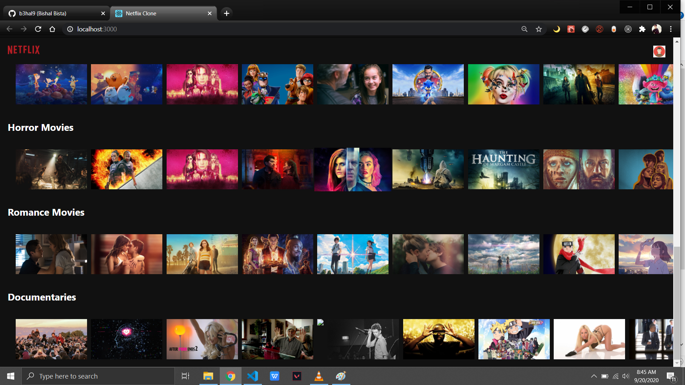
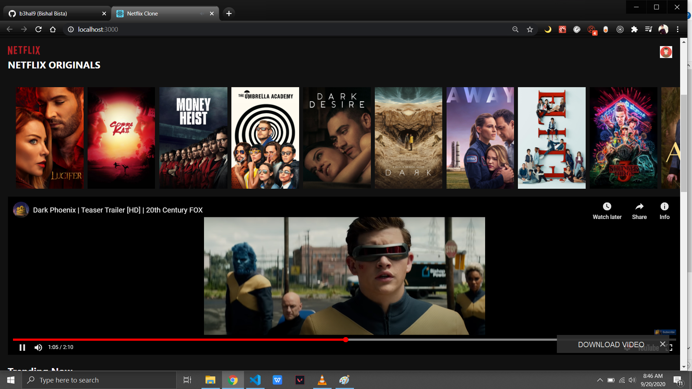

# Netflix Clone

### [Live Site](https://netflixclone-938e8.web.app)

## Home Page

## Categories

## Movie Trailer

## Introduction

This is a code repository for the Netflix clone.

Build with react, firebase and https://api.themoviedb.org/3 api

Setup:

- run `npm i && npm start` to start the development server.
